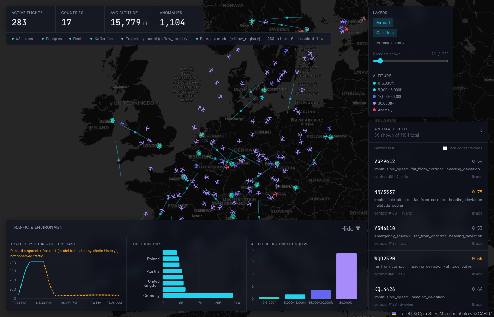

# liveflights

Real-time flight intelligence platform: OpenSky/simulated flight data streamed through Redpanda and Spark into a Delta lakehouse, modeled in dbt, scored by four ML models, and served live to a Next.js dashboard. Fully local, zero cloud credentials required — plus a live serverless AWS deployment of the same medallion pipeline.

**Live cloud deployment:**

| | URL |
|---|---|
| Dashboard | https://liveflights-prod-site-922120357133.s3.us-east-1.amazonaws.com/index.html |
| API | https://m9o2yg64dj.execute-api.us-east-1.amazonaws.com |

See [docs/aws-architecture.md](docs/aws-architecture.md) for the cloud architecture, the account-restriction story, and why this deployment runs a different region (Europe) from the local default.


## What this is

A streaming lakehouse for live aircraft position data, built to demonstrate the full modern data + ML stack end to end: ingestion (real OpenSky API or a physically-simulated fleet), Kafka-compatible streaming (Redpanda), Spark Structured Streaming into a medallion Delta lakehouse, dbt marts, four purpose-built ML models, a FastAPI backend, and an ATC-style Next.js dashboard — plus a fully serverless AWS deployment of the same pipeline, running live under a $5/month budget.



Full architecture diagram, data model, and region config: **[docs/architecture.md](docs/architecture.md)**.

## Quickstart

**Prerequisites**: Docker Desktop, [`uv`](https://github.com/astral-sh/uv), `pnpm`, Python 3.12. Verified on Apple Silicon (arm64) macOS — every container image is arm64-compatible.

```bash
git clone <this-repo> && cd liveflights
cp .env.example .env          # defaults work as-is: REGION=india, INGEST_MODE=simulate
make up                       # docker compose up -d, waits for every service to report healthy
```

`.env` is read via `pydantic-settings` by every service — every field any code reads has a default or a documented placeholder in `.env.example`. One thing worth knowing before you hit it yourself: **Postgres runs on host port `5433`, not 5432** — many dev machines already have a native Postgres bound to 5432, and this project avoids that collision rather than assuming a clean machine.

Once `make up` reports all services healthy, run each pipeline stage manually (each is a foreground process — run each in its own terminal, or background them):

```bash
# 1. Ingestion — start the simulator (no external credentials needed)
uv run --group streaming python -m ingestion.producer --mode simulate

# 2. Streaming — bronze then silver (each is a long-running Spark Structured Streaming job)
uv run --group streaming python -m streaming.jobs.bronze_stream
uv run --group streaming python -m streaming.jobs.silver_stream

# 3. Gold batch aggregates (one-shot; re-run any time)
uv run --group streaming python -m streaming.jobs.gold_batch

# 4. dbt marts
make dbt-run
make dbt-test

# 5. ML — corridor discovery must run before anomaly scoring (anomaly scoring reads corridors)
uv run --group ml --group streaming python -m ml.corridors
uv run --group ml --group streaming python -m ml.anomaly
uv run --group ml --group streaming python -m ml.trajectory
uv run --group ml --group streaming python -m ml.forecast

# 6. API
uv run --group api uvicorn api.main:app --host 0.0.0.0 --port 8000

# 7. Frontend
cd web && pnpm install && pnpm dev
```

`make seed` runs a single one-shot simulator batch if you just want to check data is flowing without a long-running producer. `make test` runs `ruff check .` plus the full pytest suite.

**Where everything lives:**

| Service | URL |
|---|---|
| Dashboard (Next.js) | http://localhost:3000 |
| API + OpenAPI docs | http://localhost:8000/docs |
| Redpanda Console | http://localhost:8090 |
| MinIO Console | http://localhost:9001 |
| MLflow | http://localhost:5500 |
| Grafana | http://localhost:3001 |
| Prometheus | http://localhost:9090 |
| Postgres | `localhost:5433` |

## Tech stack

Python 3.12 · uv · PySpark 3.5.3 · Delta Lake 3.2.1 · Redpanda (Kafka API) · MinIO (S3-compatible) · PostgreSQL 16 · dbt-core 1.8.9 · Airflow (planned) · scikit-learn · MLflow · FastAPI · Pydantic v2 · SQLAlchemy · Redis · Prometheus · Grafana · Next.js 14 (App Router) · TypeScript · React 18 · Tailwind CSS 3 · react-leaflet / Leaflet · Recharts · pnpm · Docker Compose · Terraform · AWS (Lambda, Step Functions, Glue Catalog, Athena, DynamoDB, Firehose, API Gateway, Bedrock, S3)

## Project structure

```
liveflights/
├── ingestion/       producer, OpenSky client, simulator, schemas, DLQ, tests
├── streaming/       Spark bronze/silver/gold jobs, Delta utils, enrichment
├── transform/       dbt project (staging -> intermediate -> marts)
├── orchestration/   Airflow DAGs + plugins (planned, not started — P8)
├── ml/              corridors, trajectory, anomaly, forecast, registry
├── api/             FastAPI app: routers, services, models, deps
├── web/             Next.js 14 App Router dashboard
├── infra/           terraform/ (deployed to AWS), grafana/, prometheus/
├── tests/           cross-cutting pytest — schema contract, region bucketing
├── docs/            architecture, ML, testing/metrics, engineering notes, AWS deployment
├── docker-compose.yml
├── Makefile
├── PLAN.md          full architecture + phase plan
└── PROGRESS.md      phase-by-phase build log with real verification output
```

## Documentation

- **[docs/architecture.md](docs/architecture.md)** — local architecture diagram, data model (bronze/silver/gold), region configuration
- **[docs/aws-architecture.md](docs/aws-architecture.md)** — the serverless AWS deployment: diagram, cost breakdown, account-restriction diagnoses, security notes
- **[docs/ml.md](docs/ml.md)** — the 4 ML models (corridor discovery, trajectory prediction, anomaly detection, traffic forecast), with real numbers and baselines
- **[docs/testing-and-metrics.md](docs/testing-and-metrics.md)** — data quality tests, exactly-once/restart-safety proofs, metrics, and honest limitations
- **[docs/engineering-notes.md](docs/engineering-notes.md)** — real bugs found and fixed, for the debugging-depth story
- **[PLAN.md](PLAN.md)** / **[PROGRESS.md](PROGRESS.md)** — the original phase plan and a phase-by-phase build log with real verification output

## Roadmap

- **Airflow orchestration** (`hourly_compaction`, `daily_dbt`, `daily_ml_retrain`, `daily_quality_drift` DAGs) — **planned, not started**. `orchestration/dags/` and `orchestration/plugins/` are empty directories; there is no Airflow service in `docker-compose.yml`. Every stage currently runs as a manually-invoked process.
- **Serverless AWS deployment** — **done**, see [docs/aws-architecture.md](docs/aws-architecture.md). Built out of phase order relative to the original P8→P9 plan (Airflow was skipped in favor of standing up the cloud path first).
- **Real OpenSky data in the cloud pipeline** — blocked, not scoped work: OpenSky blocks/throttles traffic from AWS IP ranges (see docs/aws-architecture.md), not something retries or IAM changes can fix from this side. A future path would need a non-AWS egress point (e.g. a small proxy on a non-cloud IP) in front of the ingest Lambda.
- **CDN in front of the cloud dashboard** — `cloudfront:CreateDistribution` is currently blocked at the account level (see docs/aws-architecture.md); revisit once/if that restriction lifts.

## License

[MIT](LICENSE)
