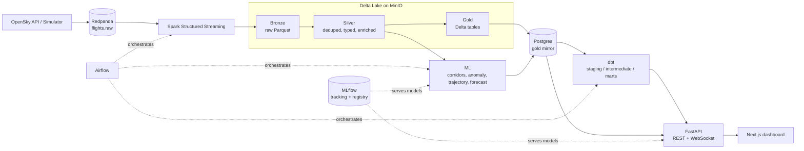

# liveflights

Real-time flight intelligence platform: OpenSky/simulated flight data streamed through Redpanda and Spark into a Delta lakehouse, modeled in dbt, scored by four ML models, and served live to a Next.js dashboard. Fully local, zero cloud credentials required.


## What this is

A streaming lakehouse for live aircraft position data, built to demonstrate the full modern data + ML stack end to end rather than any single layer in isolation: ingestion (real OpenSky API or a physically-simulated fleet), Kafka-compatible streaming (Redpanda), Spark Structured Streaming into a medallion Delta lakehouse on MinIO, dbt marts over a Postgres mirror, four purpose-built ML models (not a token IsolationForest bolted on for show), a FastAPI backend with a live WebSocket feed, and an ATC-style Next.js dashboard. Everything comes up with one command, `make up`, and runs entirely offline in simulator mode.


## Architecture



Airflow orchestration (`hourly_compaction`, `daily_dbt`, `daily_ml_retrain`, `daily_quality_drift`) is planned but not yet implemented — see [Roadmap](#roadmap). Every stage above currently runs as a manually-invoked local process; MLflow tracking/registry and the medallion pipeline are fully built and verified.

## Quickstart

**Prerequisites**: Docker Desktop, [`uv`](https://github.com/astral-sh/uv), `pnpm`, Python 3.12. Verified on Apple Silicon (arm64) macOS — every container image is arm64-compatible.

```bash
git clone <this-repo> && cd liveflights
cp .env.example .env          # defaults work as-is: REGION=india, INGEST_MODE=simulate
make up                       # docker compose up -d, waits for every service to report healthy
```

`.env` is read via `pydantic-settings` by every service — every field any code reads has a default or a documented placeholder in `.env.example`. One thing worth knowing before you hit it yourself: **Postgres runs on host port `5433`, not 5432** — many dev machines already have a native Postgres bound to 5432, and this project avoids that collision rather than assuming a clean machine.

Once `make up` reports all services healthy, run each pipeline stage manually (each is a foreground process — run each in its own terminal, or background them):

```bash
# 1. Ingestion — start the simulator (no external credentials needed)
uv run --group streaming python -m ingestion.producer --mode simulate

# 2. Streaming — bronze then silver (each is a long-running Spark Structured Streaming job)
uv run --group streaming python -m streaming.jobs.bronze_stream
uv run --group streaming python -m streaming.jobs.silver_stream

# 3. Gold batch aggregates (one-shot; re-run any time)
uv run --group streaming python -m streaming.jobs.gold_batch

# 4. dbt marts
make dbt-run
make dbt-test

# 5. ML — corridor discovery must run before anomaly scoring (anomaly scoring reads corridors)
uv run --group ml --group streaming python -m ml.corridors
uv run --group ml --group streaming python -m ml.anomaly
uv run --group ml --group streaming python -m ml.trajectory
uv run --group ml --group streaming python -m ml.forecast

# 6. API
uv run --group api uvicorn api.main:app --host 0.0.0.0 --port 8000

# 7. Frontend
cd web && pnpm install && pnpm dev
```

`make seed` runs a single one-shot simulator batch if you just want to check data is flowing without a long-running producer. `make test` runs `ruff check .` plus the full pytest suite.

**Where everything lives:**

| Service | URL |
|---|---|
| Dashboard (Next.js) | http://localhost:3000 |
| API + OpenAPI docs | http://localhost:8000/docs |
| Redpanda Console | http://localhost:8090 |
| MinIO Console | http://localhost:9001 |
| MLflow | http://localhost:5500 |
| Grafana | http://localhost:3001 |
| Prometheus | http://localhost:9090 |
| Postgres | `localhost:5433` |

### Region configuration

The platform is region-agnostic — **India is the default** (the target audience is India-based), Europe and US remain fully supported, not replaced. A single `REGION` setting drives both the simulator's airport pool and the real-OpenSky bounding box:

| `REGION` | Simulator airports | OpenSky bbox (lamin, lomin, lamax, lomax) |
|---|---|---|
| `india` (default) | 20 major Indian airports (DEL, BOM, BLR, MAA, HYD, CCU, AMD, COK, PNQ, GOI, JAI, LKO, TRV, GAU, NAG, BBI, IXC, VNS, PAT, IDR) | `6.0, 68.0, 37.0, 97.5` |
| `europe` | 20 major European airports | `45.0, 5.0, 56.0, 20.0` |
| `us` | 20 major US airports | `24.0, -125.0, 49.0, -66.0` |
| `all` | all 60 airports above | a loose superset bbox spanning all three |

Set `REGION=` in `.env` and `NEXT_PUBLIC_DEFAULT_REGION=` in `web/.env.local`; the dashboard's Region panel also switches at runtime without a restart. **Real OpenSky coverage over India is sparse** — a live sample returned ~195-205 aircraft versus 1,234 for the Europe fixture and 879 for the US fixture (see [Limitations](#limitations)) — so `INGEST_MODE=simulate` (the default) is recommended for India in any live demo.

## Data model

**Bronze** — raw JSON payload as received, plus Kafka partition/offset and ingest timestamp. Parquet, partitioned by `ingest_date`/`ingest_hour`. Append-only, no dedup, no typing beyond JSON parsing — a faithful raw log.

**Silver** — Delta table, deduped on `(icao24, time_position)` via an idempotent Delta `MERGE` (not just streaming `dropDuplicates`, which is only bounded by the watermark window). Explicit typed schema, never inferred. Enrichment columns added here:
- `speed_kmh`, `altitude_ft` (from `baro_altitude`, falling back to `geo_altitude`)
- `flight_phase` — `ground` / `climb` / `cruise` / `descent`, derived from `vertical_rate` + `on_ground`
- `geohash5` — via `pygeohash`
- `region` — coarse continental bucket from lat/lon (`Europe`, `North America`, `South Asia`, etc.)
- `data_quality_flags` — array of rule-based flags: implausible speed/altitude/vertical-rate, missing position, stale contact, emergency squawk

**Gold** — Delta, mirrored to Postgres via JDBC batch writes. Five core tables from the original data-product brief, plus three ML-authored tables:

| Table | Built by | Contents |
|---|---|---|
| `traffic_by_hour` | `gold_batch.py` | flight count, avg altitude/speed, bucketed by hour |
| `traffic_by_country` | `gold_batch.py` | rollup by `origin_country` |
| `airline_activity` | `gold_batch.py` | flight count by airline (callsign-prefix lookup) |
| `altitude_band_distribution` | `gold_batch.py` | banded altitude histogram |
| `anomaly_events` | `ml/anomaly.py` | rule + ML-flagged states with corridor context |
| `flight_corridors` | `ml/corridors.py` | discovered corridors: centroid, modal heading, altitude percentiles, polyline |
| `corridor_assignments` | `ml/corridors.py` | per-point corridor membership |
| `trajectory_predictions` | `ml/trajectory.py` | predicted vs actual next-position, for the dashboard's ghost trail |

## ML

**Design principle: rules catch physically impossible, ML catches contextually unusual.** Silver's `data_quality_flags` already threshold implausible speed, altitude, vertical rate, missing position, and emergency squawks — every state a point-wise anomaly model would learn to flag. The original plan called for an IsolationForest here; it was rejected as circular reasoning; training it on the same features `data_quality_flags` already thresholds would just rediscover those same rules with none of their interpretability and all of the training cost. The actual gap rules can't fill: a flight can be legal on every single dimension — plausible speed, altitude, vertical rate — and still be behaviorally strange: off the path everyone else takes between the same two points, against the flow of traffic, at an altitude nobody else uses on that route. That's a population-relative judgment, not a fixed bound, so it needs a model that has seen the population. That's what the four models below do.

### Corridor discovery (DBSCAN)

`ml/corridors.py` clusters scaled `latitude`, `longitude`, `sin(true_track)`, `cos(true_track)` — heading is included specifically so opposing traffic on the same lat/lon airway separates into two corridors instead of merging into one. Filtered to airborne, cruise-phase points. `eps` is chosen per fit via a k-distance elbow (max perpendicular distance from the line joining the sorted-distance curve's endpoints).

**Fit per region, not combined** — a single `StandardScaler`+DBSCAN fit across Europe and India (thousands of km apart) distorts the shared scaled feature space and collapsed silhouette from 0.607 to 0.113 in an early run. Each region now gets its own scaler, its own k-distance elbow, its own `eps`.

**Current state**: 181 corridors (180 India, 1 Europe — see [Limitations](#limitations) on why Europe is now token-sized), India silhouette **0.2016**. Silhouette is a genuinely poor metric for this problem — it assumes globular, well-separated clusters, while flight corridors are elongated and linear along a shared heading, which the metric structurally penalizes regardless of whether the clustering is correct. Validation was geometric instead: corridor endpoints were checked against real airport coordinates (one corridor's start point landed within 0.1° of Bengaluru's actual coordinates; others traced plausible Maharashtra→Haryana and Andhra-coast→Kolkata-shaped routes). Worth noting directly: cleaning stale simulator rows out of silver (see [Engineering notes](#engineering-notes)) measurably raised India's silhouette from -0.017 to 0.2016 — data quality improved model quality, not tuning.

### Trajectory prediction (gradient boosting on deltas)

`ml/trajectory.py` predicts `delta_lat`/`delta_lon` five minutes ahead — as deltas, not absolute coordinates — from current position/velocity/heading plus turn-rate, acceleration, and climb-trend computed over the last observation. Compared against a mandatory dead-reckoning baseline (great-circle projection along current track/speed).

| phase | n | model median (km) | model p90 (km) | dead-reckoning median (km) | dead-reckoning p90 (km) |
|---|---|---|---|---|---|
| cruise | 2,106 | 2.455 | 5.118 | 9.300 | 15.280 |
| climb | 103 | 2.269 | 4.626 | 10.920 | 15.806 |
| descent | 83 | 1.760 | 4.897 | 9.482 | 14.693 |
| **overall** | **2,292** | **2.422** | **5.109** | **9.425** | **15.303** |

The model wins in every phase, including cruise — the honest explanation is that it implicitly denoises the simulator's own per-reading noise (`velocity`/`vertical_rate` each get independent random jitter every tick, on top of deterministic great-circle motion): dead reckoning extrapolates from one noisy instantaneous sample, while the model, trained across thousands of examples, regresses toward the true expected speed. This was re-verified after fixing the dead-reckoning baseline to use each pair's actual elapsed time instead of an assumed fixed 300s (more physically correct, and a check against the win being a baseline artifact) — on a larger set (n=4,394) the model still won overall (median 2.489km vs 9.004km) and in cruise specifically (2.520km vs 8.972km), so the result held. **Limitation stated plainly**: all 21,969 valid (t, t+5min) pairs are `simulate`-sourced — zero are real OpenSky, because the real capture is a single point-in-time snapshot with no repeated observation of the same aircraft, so it can never form a valid pair. The result should be read as "beats dead reckoning on this simulator," not yet validated against real flight dynamics.

### Contextual anomaly detection (built on corridor discovery)

`ml/anomaly.py` scores each cruise point against its nearest corridor: lateral distance to centroid, heading deviation from modal heading, altitude z-score against that corridor's own members, plus a noise flag for unassigned points. Calibrated to a threshold of 0.62, currently flagging **3.64%** of scored points (target band 2-5%).

| bucket | count |
|---|---|
| rules_only | 226 |
| ml_only | 820 |
| both | 52 |
| neither | 22,874 |
| **total** | **23,972** |

820 states get flagged by the contextual model that rule thresholds structurally cannot see — that's the actual case for this model existing. (A sanity check — not the headline metric, since it's partly circular by construction — shows the ML model also flags 18.7% of the simulator's own rule-shaped injected anomalies.)

### Traffic forecast (gradient boosting, synthetic history)

`ml/forecast.py` predicts hourly flight counts from lag/seasonal features. **Labelled clearly, everywhere it appears in the API and dashboard, as trained on synthetic history** (`is_synthetic=True`) — real accumulated traffic history is only a couple of hours long, nowhere near enough for a `lag_24` feature, so a 7-day synthetic diurnal series stands in.

| | MAE | RMSE | MAPE |
|---|---|---|---|
| **model** | **8.506** | **10.814** | **0.1057** |
| baseline: last value | 12.759 | 14.835 | 0.1616 |
| baseline: same hour yesterday | 13.345 | 16.544 | 0.1496 |

Beats both naive baselines on every metric (test n=29 hours) — but the result describes the synthetic generator, not real traffic, until enough real hourly history accumulates to retrain against it.

## Data quality and testing

- **47 dbt tests** across staging/intermediate/marts: `not_null`, `unique`, `accepted_values`, one `relationships` test, and a singular test asserting no negative flight counts.
- **Schema contract test** (`tests/test_schema_contract.py`, 7 test functions covering field-name/type/nullability parity, callsign normalisation, and a round-trip check) proves simulator output and two independent real OpenSky captures (Europe, 1,234 states; US, 879 states) validate through the identical `FlightState` model — sanity-checked as non-vacuous by injecting a fake type drift into a throwaway copy and confirming it fails loudly.
- **Exactly-once semantics**: Spark Structured Streaming checkpointing (`./data/checkpoints`) plus an idempotent Delta `MERGE` keyed on `(icao24, time_position)` in silver — not reliance on streaming `dropDuplicates`, which is only bounded by the watermark window. Proved by replaying the same 1,234-record real fixture twice: silver's opensky-sourced row count stayed at 1,234, not 2,468.
- **Restart-safety proof**: published 5 uniquely-tagged records, `kill -9`'d `silver_stream` before it could process them (confirmed via a direct count showing zero), restarted from checkpoint, and confirmed all three independent signals agreed — exact row-count delta (+5), exact content match, and a new Delta commit timestamped after the restart. Rules out "restarted but silently did nothing" as a false positive.

## Metrics

| Metric | Value |
|---|---|
| Bronze rows | 198,857 |
| Silver rows (post India-MVP cleanup) | 29,785 (28,551 India, 1,234 real OpenSky) |
| dbt tests passing | 47/47 |
| pytest suite | 55 passed |
| Corridors discovered | 181 (180 India, 1 Europe) |
| India corridor silhouette | 0.2016 |
| Anomaly flagged rate | 3.64% (target band 2-5%) |
| Trajectory model vs dead reckoning (overall median, n=4,394) | 2.489 km vs 9.004 km |
| Forecast model MAE / RMSE / MAPE | 8.506 / 10.814 / 0.1057 |
| API p95 latency — `/api/anomalies?page_size=50` | 45.0 ms |
| API p95 latency — `/api/corridors?limit=50` | 10.3 ms |
| API p95 latency — `/api/flights/live?limit=500` | 1.9 ms |

## Limitations

- **The dataset is simulator-dominant.** Of 29,785 silver rows, 28,551 are simulated and only 1,234 are real OpenSky captures — kept deliberately as the project's only authentic data and its region-agnostic proof point, not because they're statistically sufficient on their own.
- **Real OpenSky coverage over India is sparse**: a live sample returned ~195-205 aircraft, versus 1,234 for the Europe fixture and 879 for the US fixture used elsewhere in this repo. OpenSky's coverage depends on volunteer ADS-B ground receivers, which are far denser in Europe/US than South Asia — this is a real constraint of the free data source, not a bug in this project.
- **The traffic forecast is trained on synthetic history**, not real accumulated traffic — labelled as such everywhere it surfaces. Real history will need days of continuous accumulation before it's viable to retrain against.
- **Europe is now only 627 cruise rows** after the India-MVP pivot deleted stale pre-fix simulator rows — its single resulting corridor and undefined silhouette (DBSCAN needs ≥2 clusters to compute one) exist only to prove the platform still works region-agnostically, not as a serious Europe corridor model.
- **Corridor silhouette sits below the conventional 0.4-ish "good clustering" threshold** even after fixing two real bugs (combined-region fitting, tight bounding boxes) and testing and rejecting a third hypothesis (scaling `min_samples` with row count made results worse, not better). The remaining gap looks like a genuine mismatch between a metric built for globular clusters and a hub-and-spoke network's elongated, converging corridor geometry — not something further tuning is expected to fix. Validated geometrically instead (corridor endpoints against real airport coordinates).
- **The trajectory model has only ever been evaluated against simulator-generated motion** — all 21,969 valid pairs are `simulate`-sourced, since a valid pair needs the same aircraft observed twice 5 minutes apart, and the real OpenSky data used here is a single-snapshot capture.

## Engineering notes

A few bugs worth calling out because they reflect actual debugging depth, not just feature work:

- **The same DROP-vs-TRUNCATE bug, independently, in four places.** Rewriting a gold table via `DROP TABLE ... CASCADE` (or the pandas/Spark-JDBC equivalents — `to_sql(if_exists="replace")`, `.mode("overwrite")` without `truncate=true`) silently or loudly destroys any dbt staging view built on top of that table. Found and fixed in `ml/anomaly.py` (loud: broke `dbt test` every retrain), `streaming/jobs/gold_batch.py` (loud: crashed outright once a dependent view existed), and `ml/corridors.py` + `ml/trajectory.py` (dormant — no view depended on either table yet, but identical bug class, fixed pre-emptively). Standardized on `TRUNCATE` + append everywhere; proved the fix by running `dbt test` directly after a retrain with no `dbt run` in between and getting 47/47.
- **`local[*]` Spark contention.** This codebase always runs multiple concurrent local Spark drivers (bronze, silver, gold-batch, ad-hoc queries); `local[*]` per-driver caused a multi-minute scheduling stall once more than one was running. Fixed with a configurable `local[{SPARK_CORES}]` (default 2), not a one-off workaround.
- **PySpark 3.5.3's `toPandas()` is broken on Python 3.12** — it imports `distutils`, removed outright in 3.12 (PEP 632). Fixed by never calling it: `ml/data.py` round-trips through a local temp Parquet file instead.
- **A silent port collision, not a code bug.** A pre-existing native Postgres on this machine occupied `127.0.0.1:5432`, silently swallowing connections meant for the Dockerized Postgres — JDBC writes failed with `role "liveflights" does not exist` even though that role existed fine inside the container. Remapped the container to host port 5433 rather than fighting the collision.
- **Simulated callsigns were fully random**, so no simulated aircraft ever matched the real airline-prefix lookup table and `airline_activity` showed "Unknown/Other" as its largest bucket regardless of region. Fixed with a per-region weighted real-airline-prefix table (approximating actual market share — e.g. IndiGo/Air India/Vistara dominate India) instead of random letters.

## Tech stack

Python 3.12 · uv · PySpark 3.5.3 · Delta Lake 3.2.1 · Redpanda (Kafka API) · MinIO (S3-compatible) · PostgreSQL 16 · dbt-core 1.8.9 · Airflow (planned) · scikit-learn · MLflow · FastAPI · Pydantic v2 · SQLAlchemy · Redis · Prometheus · Grafana · Next.js 14 (App Router) · TypeScript · React 18 · Tailwind CSS 3 · react-leaflet / Leaflet · Recharts · pnpm · Docker Compose · Terraform (planned)

## Project structure

```
liveflights/
├── ingestion/       producer, OpenSky client, simulator, schemas, DLQ, tests
├── streaming/       Spark bronze/silver/gold jobs, Delta utils, enrichment
├── transform/       dbt project (staging -> intermediate -> marts)
├── orchestration/   Airflow DAGs + plugins (planned, P8)
├── ml/              corridors, trajectory, anomaly, forecast, registry
├── api/             FastAPI app: routers, services, models, deps
├── web/             Next.js 14 App Router dashboard
├── infra/           terraform/, grafana/, prometheus/ (partially planned)
├── tests/           cross-cutting pytest — schema contract, region bucketing
├── docs/            architecture notes, screenshots, gitignore recommendation
├── docker-compose.yml
├── Makefile
├── PLAN.md          full architecture + phase plan
└── PROGRESS.md      phase-by-phase build log with real verification output
```

## Roadmap

- **Airflow orchestration** (`hourly_compaction`, `daily_dbt`, `daily_ml_retrain`, `daily_quality_drift` DAGs) — planned, not yet implemented. Every stage currently runs as a manually-invoked process.
- **Serverless AWS deployment** — a Terraform-provisioned S3 bucket + Lambda archive job for the drift/quality DAG's gold-snapshot sync, behind a `STORAGE_BACKEND=s3` flag that already exists alongside the default local MinIO backend — planned, not yet implemented.
