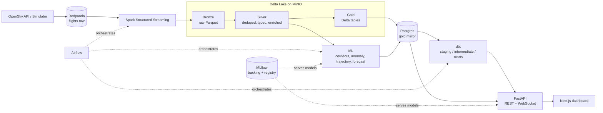

# Local architecture

A streaming lakehouse for live aircraft position data, built to demonstrate the full modern data + ML stack end to end rather than any single layer in isolation: ingestion (real OpenSky API or a physically-simulated fleet), Kafka-compatible streaming (Redpanda), Spark Structured Streaming into a medallion Delta lakehouse on MinIO, dbt marts over a Postgres mirror, four purpose-built ML models (not a token IsolationForest bolted on for show), a FastAPI backend with a live WebSocket feed, and an ATC-style Next.js dashboard. Everything comes up with one command, `make up`, and runs entirely offline in simulator mode.

## Diagram

Airflow orchestration (`hourly_compaction`, `daily_dbt`, `daily_ml_retrain`, `daily_quality_drift`) is planned but not yet implemented — see the Roadmap in the main README. Every stage above currently runs as a manually-invoked local process; MLflow tracking/registry and the medallion pipeline are fully built and verified.

## Data model

**Bronze** — raw JSON payload as received, plus Kafka partition/offset and ingest timestamp. Parquet, partitioned by `ingest_date`/`ingest_hour`. Append-only, no dedup, no typing beyond JSON parsing — a faithful raw log.

**Silver** — Delta table, deduped on `(icao24, time_position)` via an idempotent Delta `MERGE` (not just streaming `dropDuplicates`, which is only bounded by the watermark window). Explicit typed schema, never inferred. Enrichment columns added here:
- `speed_kmh`, `altitude_ft` (from `baro_altitude`, falling back to `geo_altitude`)
- `flight_phase` — `ground` / `climb` / `cruise` / `descent`, derived from `vertical_rate` + `on_ground`
- `geohash5` — via `pygeohash`
- `region` — coarse continental bucket from lat/lon (`Europe`, `North America`, `South Asia`, etc.)
- `data_quality_flags` — array of rule-based flags: implausible speed/altitude/vertical-rate, missing position, stale contact, emergency squawk

**Gold** — Delta, mirrored to Postgres via JDBC batch writes. Five core tables from the original data-product brief, plus three ML-authored tables:

| Table | Built by | Contents |
|---|---|---|
| `traffic_by_hour` | `gold_batch.py` | flight count, avg altitude/speed, bucketed by hour |
| `traffic_by_country` | `gold_batch.py` | rollup by `origin_country` |
| `airline_activity` | `gold_batch.py` | flight count by airline (callsign-prefix lookup) |
| `altitude_band_distribution` | `gold_batch.py` | banded altitude histogram |
| `anomaly_events` | `ml/anomaly.py` | rule + ML-flagged states with corridor context |
| `flight_corridors` | `ml/corridors.py` | discovered corridors: centroid, modal heading, altitude percentiles, polyline |
| `corridor_assignments` | `ml/corridors.py` | per-point corridor membership |
| `trajectory_predictions` | `ml/trajectory.py` | predicted vs actual next-position, for the dashboard's ghost trail |

## Region configuration (local stack)

The local platform is region-agnostic — **India is the default** (the target audience is India-based), Europe and US remain fully supported, not replaced. A single `REGION` setting drives both the simulator's airport pool and the real-OpenSky bounding box:

| `REGION` | Simulator airports | OpenSky bbox (lamin, lomin, lamax, lomax) |
|---|---|---|
| `india` (default) | 20 major Indian airports (DEL, BOM, BLR, MAA, HYD, CCU, AMD, COK, PNQ, GOI, JAI, LKO, TRV, GAU, NAG, BBI, IXC, VNS, PAT, IDR) | `6.0, 68.0, 37.0, 97.5` |
| `europe` | 20 major European airports | `45.0, 5.0, 56.0, 20.0` |
| `us` | 20 major US airports | `24.0, -125.0, 49.0, -66.0` |
| `all` | all 60 airports above | a loose superset bbox spanning all three |

Set `REGION=` in `.env` and `NEXT_PUBLIC_DEFAULT_REGION=` in `web/.env.local`; the dashboard's Region panel also switches at runtime without a restart. **Real OpenSky coverage over India is sparse** — a live sample returned ~195-205 aircraft versus 1,234 for the Europe fixture and 879 for the US fixture (see [limitations.md](limitations.md)) — so `INGEST_MODE=simulate` (the default) is recommended for India in any live demo.

> Note: this is the **local** stack's region setting, independent of the cloud deployment — see [aws-architecture.md](aws-architecture.md) for the cloud path's region config, which is on a different (and now Europe-focused) setup.
