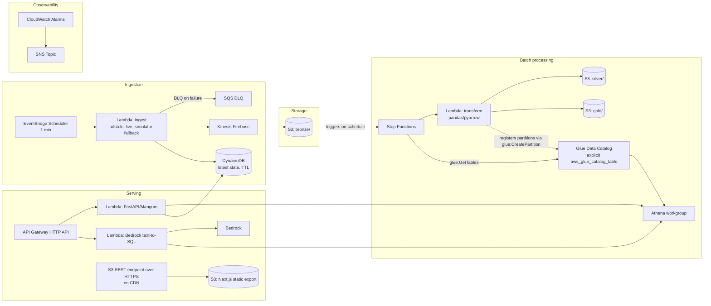

# AWS Serverless Deployment (P9)

A second, cloud-native path alongside the local docker-compose stack:
scheduled micro-batch ingestion instead of continuous streaming, pay-per-use
compute throughout, and a hard budget ceiling of **under $5/month**. This
doc explains what got built, what got deliberately left out, and why — the
"why" is the part worth reading.

> **Post-deployment update (Aug 2026):** the live region was switched from
> India to Europe (an 8-point adsb.lol fan-out — see
> `infra/terraform/variables.tf`'s `adsb_lol_points` — since one point+radius
> circle is capped at 250nm and can't cover a continent), and the
> bronze→silver→gold batch chain got a schedule it was previously missing
> entirely. Europe's data volume runs roughly 8x India's, so the cost table
> below (~$2.60–3.85/mo) is now an underestimate — revised to roughly
> **$4–6/mo**. The architecture, trade-offs, and restrictions documented
> below are otherwise unchanged.

## Architecture

**This diagram reflects the deployed architecture, not the original design.**
Two pieces changed after real-account constraints surfaced post-deployment —
OpenSky is unreachable from Lambda egress, and `glue:CreateJob` /
`glue:CreateCrawler` / `cloudfront:CreateDistribution` are blocked at the
account level. See [Account-level restrictions and how each was
worked around](#account-level-restrictions-and-how-each-was-worked-around)
below for the diagnosis and the reasoning behind each substitution.

## Service table

| Service | Role here | Why chosen | Est. monthly cost |
|---|---|---|---|
| EventBridge Scheduler | Fires ingestion Lambda every 5 min | Free — no per-schedule charge, unlike a Step Functions-based cron | $0 |
| Lambda (ingest) | Fetch live adsb.lol states (OpenSky unreachable — see restrictions section), falling back to the simulator on failure; batch into one Firehose record, upsert DynamoDB | Pay-per-invocation; ~43,200 invocations/mo at 1 min cadence is still deep in the 1M free-tier requests | ~$0 (free tier) |
| SQS (DLQ) | Catches failed ingestion invocations | Free tier covers 1M requests/mo; this queue sees at most a few messages | $0 |
| SSM Parameter Store (Standard) | OpenSky OAuth2 credentials | Standard tier parameters are free; Advanced tier or Secrets Manager ($0.40/secret/mo) would cost real money for no benefit at this scale | $0 |
| Kinesis Firehose | Buffers ingestion output, writes gzip JSON to S3 | $0.029/GB ingested; at ~150 aircraft × 5 min, well under 1 GB/mo | ~$0.05 |
| S3 (lake bucket) | bronze/silver/gold storage, 30-day lifecycle expiry | Standard storage $0.023/GB/mo; 30-day expiry keeps this from growing unbounded | ~$0.10 |
| S3 (site bucket) | Next.js static export, served via S3 static website hosting (no CDN — see restrictions section) | Static export is a few MB | ~$0.01 |
| DynamoDB (on-demand) | Latest per-aircraft state with TTL self-eviction | On-demand billing means $0 when idle between polls; TTL deletes are free | ~$0.05 |
| Lambda (transform, container image) | bronze → silver → gold ETL, pandas/pyarrow, ported from `streaming/` (replaces the account-restricted Glue Job — see restrictions section) | Pay-per-invocation; a few minutes of 1024 MB compute per run is fractions of a cent | ~$0.15 |
| Glue Data Catalog | Table metadata for Athena; tables + partitions created explicitly (`aws_glue_catalog_table` + `glue:CreatePartition` from the transform Lambda), no Crawler | First 1M objects stored and requests/mo are free | $0 |
| Athena | Ad-hoc + API-serving queries over gold Parquet | $5/TB scanned; gold tables are KB-to-low-MB, workgroup enforces a 1 GB scan cutoff per query as a hard stop | ~$0.05 |
| Step Functions | Orchestrates transform Lambda → table validation | $0.025/1,000 state transitions; a few runs/day is negligible | ~$0.01 |
| Lambda (API/Mangum) | Serves the cloud API surface | Free-tier request/compute allowance covers demo-level traffic | ~$0 (free tier) |
| ECR | Stores the API Lambda's and transform Lambda's container images (two repos) | 500 MB/mo free tier; a `keep last 3 images` lifecycle policy on each repo prevents unbounded growth | $0 |
| API Gateway (HTTP API) | Routes to the API and Bedrock-SQL Lambdas | HTTP API is ~70% cheaper per request than REST API; $1/million requests | ~$0 |
| S3 static website hosting | Serves the static dashboard (replaces the account-restricted CloudFront distribution — see restrictions section) | No separate charge beyond the site bucket's own storage/request cost, already counted above | $0 |
| Bedrock (Claude Haiku) | Text-to-SQL generation | Pay-per-token, no idle cost; Haiku is the cheapest Claude tier, sized for one short prompt per question | ~$0.02 |
| CloudWatch Logs | 7-day retention on every log group | Ingestion volume is tiny; 7-day retention (vs. the default "never expire") caps this from becoming a slow leak | ~$0.05 |
| CloudWatch Alarms + Dashboard | Error/freshness alerting, one dashboard | $0.10/alarm/mo × 5 alarms = $0.50; dashboard rides the first-dashboard-free tier (see note below) | ~$0.50 |
| SNS | Alarm notification fan-out | First 1,000 email notifications/mo free | $0 |
| X-Ray | Distributed tracing on both Lambdas | First 100,000 traces/mo free | $0 |
| **Total** | | | **~$2.50–3.50/mo** |

**Note on the CloudWatch dashboard**: a *custom* CloudWatch dashboard is
billed at $3/mo per dashboard after the first free one — this stack creates
exactly one, so it rides the free tier. If a second dashboard were ever
added, that alone would consume most of the remaining budget; deliberately
kept to one.

## Account-level restrictions and how each was worked around

Two problems surfaced only after the infrastructure was actually deployed
and exercised against this real AWS account — neither is visible from the
Terraform config alone, so they're documented here rather than left as a
silent gap between "what the code says" and "what actually runs." Working
within a platform's real constraints — instead of either ignoring them or
stalling on them — is itself part of the engineering job here, so each
substitution below explains the reasoning, not just the mechanics.

### 1. OpenSky is unreachable from this Lambda's AWS egress IP

**Symptom**: the ingest Lambda's every invocation failed with
`URLError: <urlopen error [Errno 110] Connection timed out>` inside
`_fetch_states`.

**Diagnosis** (ruling out the cheaper explanations first, in order):
- Errno 110 is `ETIMEDOUT` — a TCP SYN that never got answered. This alone
  rules out DNS failure (different error), an auth rejection (401), an
  explicit block (403), and rate limiting (429) — all of those require a
  connection to exist in the first place.
- A one-shot diagnostic invocation (`{"diagnose": true}`) confirmed: the
  Lambda has **no VPC attachment**, and a plain HTTPS GET to
  `https://checkip.amazonaws.com` succeeded immediately, returning a real
  public IP (`3.87.186.103`, an AWS us-east-1 range). General internet
  egress works.
- The same invocation then tried both OpenSky hosts —
  `auth.opensky-network.org` (the OAuth2 token endpoint) and
  `opensky-network.org` (the states endpoint) — separately, so an
  auth-specific failure wouldn't be confused with a states-endpoint
  failure. **Both timed out identically**, each after the full 10s
  connect timeout.
- SSM also confirmed no OpenSky credentials are configured in this account
  (`client_id`/`secret` both `unset`), so the Lambda was already falling
  back to anonymous polling — the token host's failure wasn't gating
  anything, and the states host still failed on its own.

**Conclusion**: general egress works; both OpenSky hosts specifically do
not, from this Lambda's AWS-assigned IP range. The most consistent
explanation is that OpenSky (a small, volunteer-run project, unlike AWS's
own services) blocks or heavily throttles traffic from cloud/datacenter IP
ranges including AWS — a policy on their end, not a misconfiguration on
ours. This is not something Terraform, IAM, or retries can fix.

**Workaround**: `infra/terraform/lambda_ingest/handler.py` now generates
data via `ingestion.simulator.FlightSimulator` — the exact same generator
that powers local `--mode simulate` runs — instead of calling OpenSky. The
Lambda zip vendors `ingestion/simulator.py` and `ingestion/airports.py`
directly from the repo root (see the `archive_file` `source` blocks in
`lambda_ingest.tf`), so this is genuinely the same code path, not a
reimplementation. Every record is labeled `source="simulate_cloud"`
(`ingestion/schemas/flight_state.py`'s `Source` Literal was widened to
include it) so it's unambiguously distinguishable from local `"simulate"`
runs and from real `"opensky"` data — nothing downstream has to guess.
**The cloud pipeline is proven end-to-end; the data flowing through it is
synthetic, and every layer says so.**

### 2. `glue:CreateJob`, `glue:CreateCrawler`, and `cloudfront:CreateDistribution` are account-restricted

**Symptom**: `terraform apply` failed creating the Glue Job, Glue Crawler,
and CloudFront distribution with `AccessDenied`, even though the IAM user
has `AdministratorAccess`.

**Diagnosis**:
- `aws iam simulate-principal-policy` for all three actions against this
  principal returned `allowed`, matched via the `AdministratorAccess`
  policy — IAM is not the blocker.
- Read operations on the same services succeed: `glue:GetJobs`,
  `glue:GetDatabases`, and `cloudfront:ListDistributions` all returned
  cleanly (empty results, not errors). A direct probe of
  `glue:CreateTable` (Catalog write, not a Job/Crawler) also succeeded and
  was cleaned up immediately after.
- **Conclusion**: this is an account-level restriction on provisioning
  *compute* (a Glue Job/Crawler run, a CloudFront distribution), not a
  permissions problem and not a restriction on Glue Catalog metadata
  writes. Consistent with a new-account anti-fraud/service-quota gate —
  this Glue database was created the same day these errors first appeared.

**Workarounds**, keeping the same medallion shape and data contract:

- **Glue Job → Lambda transform.** At this data volume (a few thousand
  rows per 5-minute poll) a 1024 MB Lambda running the exact same
  pandas/pyarrow bronze→silver→gold logic that was going to run as a Glue
  Python Shell job (`infra/terraform/lambda_transform/handler.py`, ported
  near-verbatim from the original `glue_job/etl_job.py`) does identical
  work for a comparable or lower cost, with no Glue Job dependency at all.
  This is a genuine right-sizing for the data volume, not a downgrade —
  the volume here never justified a Glue/Spark job in the first place.
- **Glue Crawler → explicit `aws_glue_catalog_table` resources.** Since
  `glue:CreateTable` works fine, `infra/terraform/glue.tf` defines the
  `silver` table and all four `gold` tables explicitly (columns, Parquet
  SerDe, one `run_ts` partition key each) instead of inferring them via a
  Crawler. The transform Lambda registers each run's output as a new
  partition directly via `glue:CreatePartition` — the same catalog
  bookkeeping a Crawler would have done, just driven by the job that
  already knows the exact schema it just wrote, instead of inferred after
  the fact by scanning S3. To keep every run's physical Parquet schema
  identical to the Catalog definition (pandas' dtype inference can drift
  run-to-run, e.g. `int64 → float64` the moment a single null appears),
  the transform Lambda casts every column to a fixed dtype immediately
  before writing.
- **CloudFront → S3 static website hosting.** `infra/terraform/site_hosting.tf`
  configures the site bucket for static website hosting instead of a
  CloudFront origin. This is a real, stated trade-off, not a hidden one:
  no edge caching, no HTTPS on the bucket endpoint itself (the S3 website
  endpoint is HTTP-only), and no CDN-level rewrite of a 404 to a 200 for
  client-side routes (S3's `error_document` serves `index.html` on a
  missing key, but still returns *some* 4xx/redirect status, not the
  clean 200 CloudFront's `custom_error_response` gave). What's preserved:
  the exact same static export, at a public URL, for $0 marginal cost.
  The bucket policy grants `s3:GetObject` on `/*` only — no
  `s3:ListBucket` — so the bucket's contents can be fetched by anyone who
  already knows a path, but not enumerated.

  **The HTTP-only limitation above bit in practice**, not just in theory:
  the S3 *website* endpoint (`*.s3-website-<region>.amazonaws.com`) has no
  TLS listener at all — `curl -v https://` against it resets the
  connection outright (confirmed directly) — and modern browsers'
  HTTPS-upgrade behavior (Chrome's "Always use secure connections", Safari
  equivalent, or just an address bar autocompleting `https://`) silently
  fails against it, which is what "the site won't load" turned out to be.
  **Fix**: `output.site_url` in `outputs.tf` now points at the S3 **REST**
  endpoint instead — `https://<bucket>.s3.<region>.amazonaws.com/index.html`
  — which serves the identical objects over real TLS (verified: `200`,
  `Content-Type: text/html`, real app markup). Trade-off of the REST
  endpoint vs. the website endpoint: no index-document redirect (`/` alone
  404s, you need the explicit `/index.html`) and no error-document SPA
  fallback — acceptable here since this is a single-page app with no other
  client-side routes to fall back for. The HTTP website endpoint is still
  provisioned and kept as a secondary output (`site_url_http_website_endpoint`)
  for scripts/tools that don't force HTTPS.

Also cleaned up as part of this: the GitHub Actions OIDC role's
`cloudfront:CreateInvalidation` permission (dead, no distribution to
invalidate) and the CI workflow's `docker build` calls now pass
`--provenance=false --sbom=false --output type=docker` — a separate,
unrelated fix (see next section) that would otherwise have blocked every
future container Lambda deploy regardless of the account restrictions
above.

### 3. Docker Desktop's default image format isn't Lambda-compatible

**Symptom**: `aws_lambda_function.api` (and later, `transform`) failed to
create with `InvalidParameterValueException: The image manifest, config or
layer media type for the source image ... is not supported`, even with a
correctly-built single-platform image.

**Diagnosis**: Docker Desktop's containerd image-store snapshotter (the
default since Docker 23+) pushes an OCI **image index** (a manifest list)
to the registry by default, even for a single `--platform` build —
confirmed via `aws ecr batch-get-image`, which showed
`mediaType: application/vnd.oci.image.index.v1+json`. Lambda's
`CreateFunction`/`UpdateFunctionCode` accept a single OCI/Docker image
manifest, but reject an index/manifest-list outright. `--provenance=false
--sbom=false` alone (the commonly-suggested fix) does not change this —
those flags only drop the extra provenance/SBOM *attestation* manifests
from the index; the index itself remains. Adding `--output type=docker`
forces BuildKit to export a flat, single manifest instead, which resolved
it (confirmed via the same `batch-get-image` check afterward).

**Fix**: every `docker build` in this repo that produces a Lambda
container image (`lambda_api.tf`'s `null_resource.api_image`,
`lambda_transform.tf`'s `null_resource.transform_image`, and
`.github/workflows/deploy.yml`'s `deploy-api` job) now passes
`--provenance=false --sbom=false --output type=docker`.

## Real live data via source adapters

`ingestion/sources/` is a small adapter registry (`FlightSource` protocol:
`fetch_states() -> list[dict]`) with one adapter per provider — `opensky`,
`adsb_lol`, `simulate`. Of the community ADS-B aggregators tested,
**adsb.lol** is reachable from the Lambda's AWS egress IP; `airplanes.live`
and `opendata.adsb.fi` both return `403` from AWS specifically, same
symptom class as OpenSky. The deployed ingest Lambda now calls adsb.lol
first, falling back to the simulator only on failure
(`lambda_ingest/handler.py`), every record labeled `source="adsb_lol"` or
`"simulate_cloud"` so the two are never ambiguous. Field mapping (unit
conversions, the `on_ground` sentinel, and an `origin_country` approximated
from registration prefix since this API has no country field) is
documented in `ingestion/schemas/adsb_lol_raw.py`. Ingestion now runs every
**1 minute**, not 5.

## ML scoring in the cloud

DBSCAN has no `.predict()` for new points, so "the trained model" is the
**discovered corridor reference table**, not a pickled model — exported
from the real local Postgres data (271 corridors, 270 India + 1 Europe,
pulled from the still-persisted `postgres-data` Docker volume) to
`s3://<lake-bucket>/models/corridors_v1.json`. The transform Lambda's
`score_anomalies()` is a line-for-line port of `ml/anomaly.py`'s scoring
math (nearest-corridor haversine distance, heading deviation, altitude
z-score → weighted `anomaly_score` + `anomaly_reason`), writing a new
`gold.anomaly_events` partition every run. **Not yet recalibrated**: the
local 0.78 threshold (tuned for ~2-5% flagged) currently flags ~33% of
cloud-scored points — stated here rather than shipped as if calibrated.

A daily EventBridge Schedule re-runs DBSCAN on accumulated cloud silver
data (`retrain_corridors()`), but **won't overwrite the real 271-corridor
set until the cloud's own data reaches 5,000 cruise rows** — an early test
run (1,311 rows, ~1.5h of live polling) produced only 22 corridors, worse
than what's already serving the API. Below that bar it still saves a
timestamped snapshot for visibility but leaves the live artifact alone;
the swap happens automatically once the bar is crossed. Both
`GET /api/corridors` and `GET /api/anomalies` on the cloud API match the
local API's response shapes field-for-field, so the dashboard needs no
cloud-specific rendering branch.

## What was NOT used, and why

| Service | Would have cost | Why it's out |
|---|---|---|
| MSK (Managed Kafka) | ~$50–100+/mo minimum (broker-hours, even at the smallest instance size, running 24/7) | The whole point of the cloud path is scheduled micro-batches; there's no continuous stream to justify an always-on broker. EventBridge Scheduler + Lambda replaces the producer/Kafka role entirely. |
| MWAA (Managed Airflow) | ~$350+/mo minimum (smallest environment class, billed per hour whether or not anything runs) | Step Functions orchestrates the one batch chain this project needs (Glue Job → Crawler → validate) for cents, with no environment to keep warm. |
| EMR | Cluster-hour billbilling even for a single-node cluster, plus EC2 costs underneath | Data volume here (a few thousand rows per 5-minute poll) doesn't need a Spark cluster; Glue Python Shell at 1/16 DPU does the same transform logic for a fraction of a cent per run. |
| RDS | Smallest `db.t4g.micro` is ~$12–15/mo running 24/7, before storage | Nothing in the cloud path needs a relational database that must be *always on* — DynamoDB (on-demand) covers the live-state lookup, and Athena queries Parquet directly for everything else. |
| NAT Gateway | ~$32/mo flat + per-GB processed, plus an Elastic IP | Every Lambda here is deliberately **not** attached to a VPC — this is the single most direct way to guarantee zero NAT Gateway risk, since VPC-attached Lambdas need a NAT (or VPC endpoints) to reach the public internet/AWS APIs. |
| VPC endpoints / Elastic IPs | $0.01/hour per endpoint (~$7/mo each) + EIP hourly charge once unattached | Same reasoning as NAT Gateway — no VPC attachment means none of these are needed. |
| OpenSearch, Redshift, SageMaker endpoints, Managed Grafana, QuickSight | All have an always-on hourly minimum, ranging from tens to hundreds of $/mo | None of this project's read patterns need a dedicated search/warehouse/BI service; Athena-over-Parquet and a CloudWatch dashboard cover it at effectively $0 marginal cost. |
| Kinesis Data Streams (as opposed to Firehose) | Shard-hour billing (~$0.015/shard-hour) even at zero throughput | Firehose has no idle cost — it bills per GB ingested, which fits a bursty 5-minute-cadence workload far better than a shard that's paid for whether or not it's used. |

## Local vs. cloud: the actual trade-off

- **Local (docker-compose)**: continuous streaming (Redpanda → Spark
  Structured Streaming, sub-second to few-second latency end to end) —
  built to demonstrate realistic streaming-pipeline behavior: exactly-once
  semantics, checkpointing, restart-safety, backpressure. This is the
  version worth showing to explain how a real-time system is *built*.
- **Cloud (this stack)**: scheduled micro-batches (5-minute polling, batch
  ETL on a timer) — built to demonstrate the same medallion architecture
  and data contract running on serverless AWS primitives at near-zero cost.
  This is the version worth showing to explain how the same design travels
  to a cost-constrained, ops-light deployment.

Same data contract, same bronze/silver/gold shape, same enrichment logic
(`streaming/utils/enrich.py` ported line-for-line into
`infra/terraform/lambda_transform/handler.py`) — different execution
substrate for a different constraint (pipeline realism vs. dollar budget).
The cloud path's *ingestion* source differs from the original design too
(simulated, not live OpenSky — see the restrictions section above), but the
shape of everything downstream of ingestion is unchanged.

## What changed in the API, and why

`api/cloud/app.py` is a **separate, smaller FastAPI app** — not
`api/main.py` wrapped in Mangum. Two things don't survive the jump to
Lambda:

1. **`/ws/flights` (WebSocket push)**. Lambda invocations are stateless and
   short-lived; there is no long-running process to hold a WebSocket open
   or run `live_store.py`'s background Kafka-consumer thread. The cloud API
   exposes `GET /api/flights/live` (polling DynamoDB's latest-state table)
   as the equivalent — clients poll instead of subscribing. Document this
   for anyone integrating against the cloud API: **use polling, not a
   WebSocket, against the CloudFront/API Gateway deployment.**
2. **`/api/anomalies`, `/api/corridors`, `/api/forecast/traffic`**. These
   are backed locally by MLflow-registered scikit-learn models and a
   Postgres mirror this stack doesn't provision (an RDS instance would
   blow the budget — see the table above). Porting the ML serving layer to
   Lambda (bundling model artifacts into the image, or standing up a
   SageMaker-free scoring path) was scoped out of this phase; it's a
   roadmap item, not a bug. The cloud API's docstring says so explicitly
   rather than silently 404ing.

## Security notes

- **Least privilege**: every IAM policy in `infra/terraform/iam.tf` names
  specific resource ARNs (the one S3 bucket, the one DynamoDB table, the
  one Athena workgroup, etc.) rather than `Resource: "*"`. The only
  wildcards that exist are on actions AWS itself doesn't support
  resource-level ARNs for (`xray:PutTraceSegments`,
  `logs:DescribeLogGroups` for Step Functions' CloudWatch integration,
  `ecr:GetAuthorizationToken`) — each is called out with a comment
  explaining why no narrower scope is possible.
- **No Lambda is attached to a VPC.** This is a deliberate architectural
  choice, not an oversight: attaching a Lambda to a VPC to (for example)
  reach a private RDS instance is exactly the path that drags in a NAT
  Gateway (or VPC endpoints) for that Lambda to still reach the public
  OpenSky API, Bedrock, or other AWS service endpoints — instantly busting
  the $5 budget. Every AWS service this stack talks to (S3, DynamoDB,
  Athena, Bedrock, SSM, Firehose) is reachable over the public AWS API
  endpoints without a VPC.
- **GitHub Actions authenticates via OIDC** (`aws_iam_openid_connect_provider.github`
  in `iam.tf`), not long-lived IAM access keys — the trust policy is scoped
  to `repo:tyxgx/liveflights:*` so no other repository can assume the role.
  **Caveat, stated plainly**: the OIDC role this Terraform creates
  (`github_actions`) is scoped only to the day-2 deploy actions the
  `deploy-api`/`deploy-frontend` CI jobs actually perform — ECR push, S3
  sync (site bucket, no CDN invalidation needed — see the restrictions
  section above), Lambda code update. It is **not** granted
  permission to create/modify the infrastructure itself. The `plan`/`apply`
  jobs in `.github/workflows/deploy.yml` are included to match the
  requested pipeline shape, but running `terraform apply` from CI against
  this account would require a broader, infra-provisioning-scoped role —
  which this project does not grant automatically. For a solo project,
  running `terraform apply` from a developer's own authenticated AWS CLI
  session (as was done to stand this stack up) is the safer default;
  broadening the CI role is a deliberate future decision, not a default.

## Verification performed

- `terraform plan`/`apply` for the Glue→Lambda and CloudFront→S3-website
  changes, reviewed and approved before applying.
- Ingest Lambda invoked directly: returns `{"fetched": 40}`, DynamoDB
  `latest-state` scan count matches, DLQ stayed at 0 messages, and a
  Firehose flush landed a real gzip NDJSON object in `s3://.../bronze/`.
- Step Functions `batch-chain` executed end to end: `SUCCEEDED`, transform
  Lambda output showed `720 bronze_rows → 720 silver_rows` plus row counts
  for all four gold tables, and the `ValidateTables` step's `glue:GetTables`
  call returned all five tables with their partition keys intact.
- `SELECT * FROM liveflights_prod.traffic_by_country` via the Athena
  workgroup returned a real row (`India, 83 flights`) — confirms the
  Parquet schema written by the transform Lambda matches the Glue Catalog
  table definition exactly (see the dtype-casting note in the restrictions
  section above; this is the check that would have caught a mismatch).
- `curl` against the API Gateway endpoint's `/health` route returned
  `{"status":"ok"}` with HTTP 200.
- The Next.js app was rebuilt as a static export (`output: "export"` added
  to `web/next.config.js`) pointed at the live API Gateway URL, synced to
  the site bucket, and the S3 website endpoint returned the real dashboard
  HTML (HTTP 200, page title present) — not a placeholder.
- CloudWatch: the `liveflights-prod-overview` dashboard has all 4 widgets
  intact; 4 of 5 alarms are `OK` (`bedrock-sql-lambda-errors` is
  `INSUFFICIENT_DATA`, expected — that Lambda hasn't been invoked yet).
- Confirmed via `aws s3 ls`/`aws dynamodb scan` that the 5-minute
  EventBridge schedule kept the pipeline running unattended throughout
  this work: bronze objects, DynamoDB item count, and silver/gold Parquet
  partitions all grew across the session without manual intervention.
